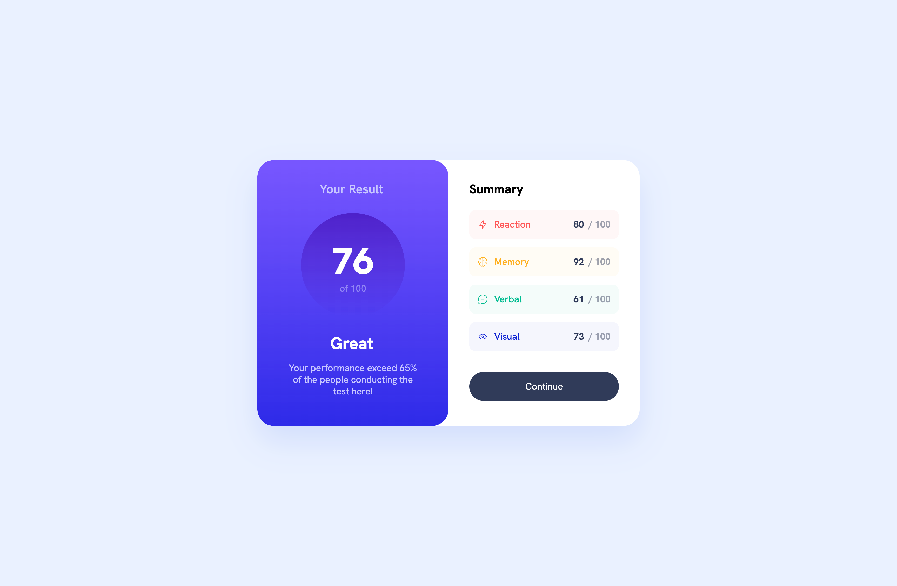

# Frontend Mentor - Results summary component solution

This is a solution to the [Results summary component challenge on Frontend Mentor](https://www.frontendmentor.io/challenges/results-summary-component-CE_K6s0maV). Frontend Mentor challenges help you improve your coding skills by building realistic projects. 

## Table of contents

- [Overview](#overview)
  - [The challenge](#the-challenge)
  - [Screenshot](#screenshot)
  - [Links](#links)
- [My process](#my-process)
  - [Built with](#built-with)
- [Author](#author)

## Overview

### The challenge

Users should be able to:

- View the optimal layout for the interface depending on their device's screen size
- See hover and focus states for all interactive elements on the page

### Screenshot

### Links

- Solution URL: [https://github.com/web2feel/results-summary-fe-mentor](https://github.com/web2feel/results-summary-fe-mentor)
- Live Site URL: [https://results-summary-fe-mentor.netlify.app/](https://results-summary-fe-mentor.netlify.app/)

## My process

### Built with

- Semantic HTML5 markup
- CSS custom properties
- Flexbox
- CSS Grid
- Mobile-first workflow
- TypeScript
- [React](https://reactjs.org/) - JS library
- [TailwindCSS](https://tailwindcss.com) - CSS framework

## Author

- Frontend Mentor - [@web2feel](https://www.frontendmentor.io/profile/web2feel)
- Twitter - [@jinson_dev](https://www.twitter.com/jinson_dev)

